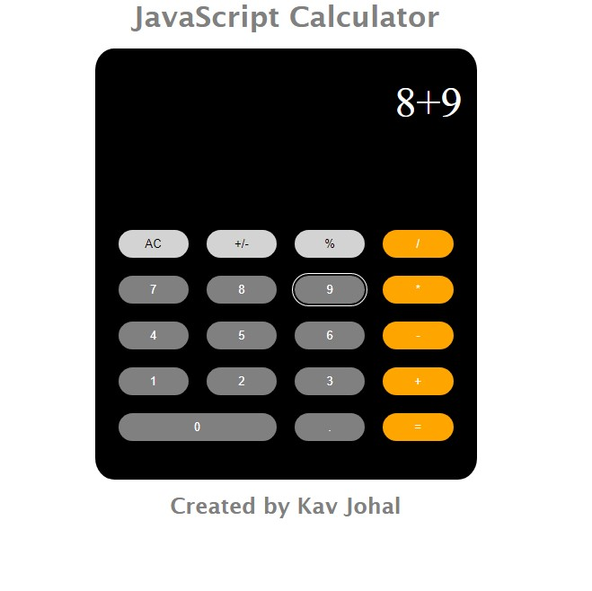

# JavaScript-Calculator

For this project I was breifed to recreate the iPhone calculator model. I have created a basic JavaScript webpage using HTML, SCSS and JavaScript. It performs basic opperations, by using event handlers that are assigned to each button (DOM manipulation) and functions to perform the equations. 
 
Click [here](https://kav97.github.io/JavaScript-Calculator/) to view the project. 
 
 

